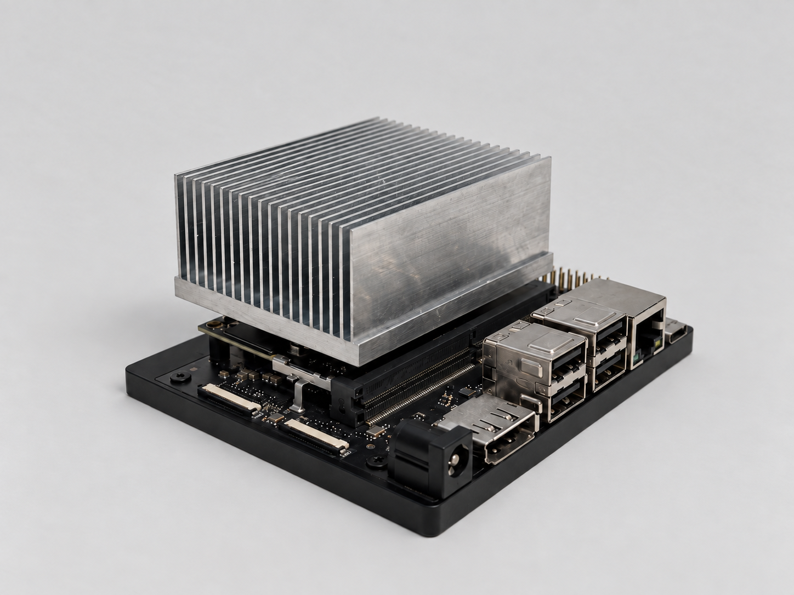

# Edge Compute Thermal Design

A custom active cooling assembly for an NVIDIA Jetson Orin Nano running sustained AI inference.


## Result

| | Stock cooler | Custom assembly |
|---|---|---|
| Steady-state package temperature | 75 °C | 62 °C |
| Module power | 21 W | 21 W |
| Ambient | 27 °C | 27 °C |
| Test duration to steady state | 30 min | 30 min |

Measured at matched power and ambient temperature. Measurement method: [tegrastats / thermocouple at X / IR — fill in].
<!-- 
## Problem

The Jetson Orin Nano dissipates 21 W under sustained inference. [One or two sentences: what was the stock cooler doing that made this worth solving? Thermal throttling at a specific clock? Fan noise? Enclosure constraint? Write what actually drove it, not a generic statement about heat being bad.]

Design constraints:

- Module preload must stay under NVIDIA's 60 psi limit on the SoC
- [Envelope constraint, if any: max height, footprint, mounting pattern]
- [Airflow constraint: intake/exhaust orientation, acoustic limit, anything else]
-->
## Thermal design

### Fin geometry

Swept fin count and spacing across 12 configurations in SolidWorks Flow Simulation, using the fan's P-Q curve to set the operating flow rate for each geometry rather than assuming a fixed CFM.

The trade is direct: more fins add surface area but narrow the channels, raising flow impedance and moving the fan back along its curve to a lower flow rate. Past a point the added area stops paying for the lost flow.


Selected **18 fins at 1.5 mm spacing**.

| Fin count | Spacing (mm) | [Flow rate / ΔP / Rth] | Package temp (°C) |
|---|---|---|---|
| [fill from your sweep — this table is the most valuable thing in this README] | | | |

### Fan and duct


[Fan part number], with the system impedance curve overlaid to find the operating point at [FLOW RATE].

The duct [what it does: directs flow through the fin channels instead of letting it spill around the heatsink / seals the bypass path / whatever is true].

### Mounting and preload

The module is preloaded to **30 psi** using spring-loaded fasteners, against NVIDIA's 60 psi maximum. Springs rather than rigid screws so preload is set by spring rate and compression rather than by installation torque, which keeps it repeatable and bounded.

Thermal interface material: [TIM part / type, bond line thickness if you controlled it].

## Build



- Heatsink on a CNC-machined 6061 aluminum base
- Ducted fan path
- 3D-printed enclosure (MJF PA12-HP Nylon)

### Design for manufacturing

Supplier DFM review flagged internal-corner interference at the fin slots, caused by [tool radius / minimum internal radius achievable by the process]. Increased fin-slot clearance by **0.2 mm per side** to clear it.

[If you changed anything else after DFM review, add it. If this was the only change, say so — a single well-explained change reads as real; a list of vague ones does not.]

## Validation

[How you actually tested it. A reviewer will weight this section heavily, and a thermal claim with no stated method is not a claim.]

- Load: [what workload, at what utilization, for how long]
- Instrumentation: [what you measured with, where the sensor sat]
- Ambient control: [how you held ambient constant between the two runs]
- Repeats: [how many runs per configuration]


### Simulation vs measurement

[Predicted vs measured package temperature, and the delta. If they disagreed, say by how much and what you think caused it. A candid gap between CFD and reality is more convincing than a perfect match.]

## Repository

```
cad/          STEP exports and native SolidWorks files
simulation/   Flow Simulation plots and results table
drawings/     Dimensioned drawing with GD&T callouts
photos/       Build and assembly photos
```

Raw Flow Simulation project files are not included. Exported plots and the results table cover the analysis.

## What I would do differently

[Two or three specific things. This section is where interviewers look for engineering judgment, and it is the cheapest credibility in the whole document. Examples of the shape: a parameter you would have swept that you did not, an instrumentation choice you would change, a manufacturing decision you would revisit.]

---

David Shimizu · [davidshimizu1.github.io](https://davidshimizu1.github.io/) · [LinkedIn](https://linkedin.com/in/davidshimizu)
