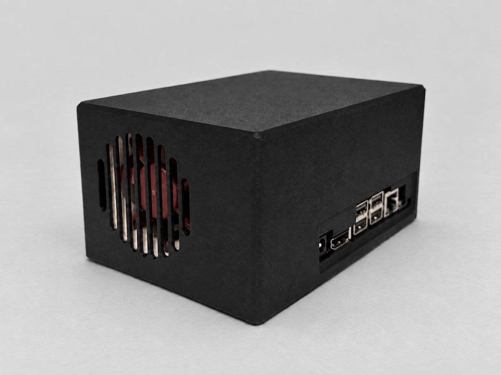
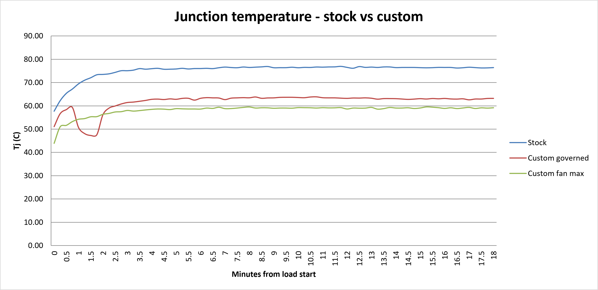
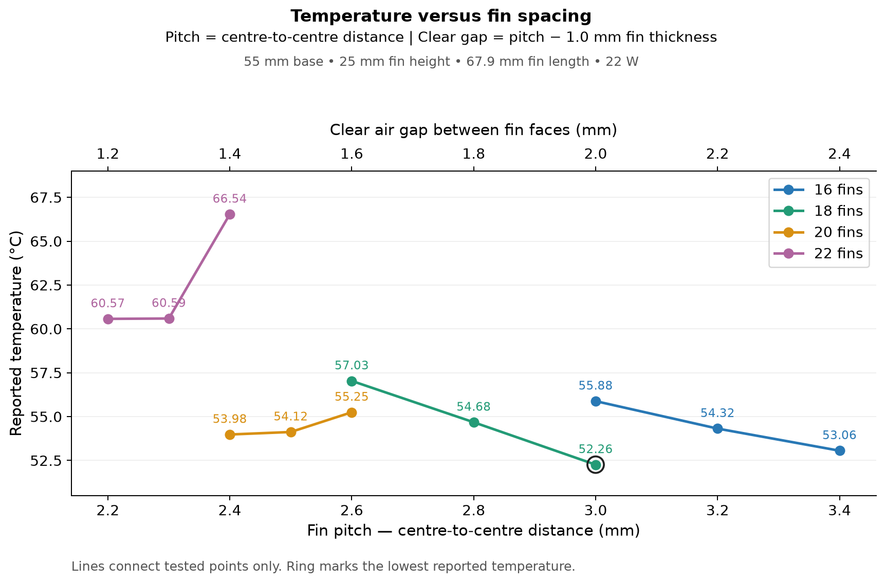

 # Thermally-Managed Edge Inference Module

A custom active cooling solution for an NVIDIA Jetson Orin Nano Super, designed in SolidWorks, simulated in Flow Simulation, CNC machined, and validated against the stock cooler under sustained AI inference.




---

## Result

Sustained ResNet-50 FP16 inference at the Orin's 25 W power mode, run for 30 minutes to steady state:

| | Stock cooler | Custom solution |
|---|---|---|
| Steady-state junction temp | 74.5 °C | **62.0 °C** |
| Board power (VDD_IN) | 20.9 W | 21.3 W |
| Thermal resistance, junction to ambient | 2.37 °C/W | **1.74 °C/W** |
| GPU clock under load | 909 MHz | 1007 MHz |

A 12.5 °C reduction in junction temperature and a 27% reduction in thermal resistance, measured while dissipating slightly more power than the baseline. Junction temperature sat 37 °C below the Orin's 99 °C throttle threshold, and the GPU held 1003 MHz or better across all 1776 samples taken under load.

Thermal resistance is computed as `R = (Tj - Tambient) / P`, following NVIDIA's definition in TDG-11127-001.


---

## What this is

An edge AI compute module built around a Jetson Orin Nano Super running at its top power mode to generate a realistic, controllable thermal load. Around that heat source sits a cooling solution I designed end to end:

- A CNC aluminum heatsink with a bonded fin stack and a tapered pedestal for the bare die
- An MJF PA12 enclosure that defines the airflow path from intake through the fin stack to exhaust
- A spring-loaded mount that sets contact pressure at the die interface
- A CFD model built in SolidWorks Flow Simulation, used to select fin geometry before any metal was cut

The inference workload is a means to an end. The engineering content is mechanical and thermal: design the part, predict its behavior, build it, instrument it, and find out how close the prediction was.

---

## Design

### Heatsink

The Orin Nano is die-referenced with no integrated heat spreader, so spreading resistance is a co-dominant term rather than a rounding error. At a 5 mm base thickness it accounts for roughly 9 °C on its own. The base uses a tapered pedestal to spread heat out of the die footprint before it reaches the fin stack.

Fin count was selected by CFD sweep across 12 configurations. Die maximum temperature bottomed out at 18 fins:



The 22-fin case regressing is the interesting one. Adding fins buys surface area but narrows the channels, and past a point the velocity loss costs more than the area gains. Seeing that tradeoff turn over in simulation is what justified stopping at 18 rather than packing in as many fins as would fit.
<!-- 
Fins are bonded into through-slots in the base with MG Chemicals 8329TCM thermal epoxy. Slot width opened 0.2 mm per side after supplier DFM review flagged internal-corner interference from a 0.5 mm end mill corner radius. Because the slots are open at both ends, fins can float laterally within the groove, so the clearance spec has to cover worst-case float rather than nominal position.
-->
The part ships as-machined. Anodizing would add an Al₂O₃ layer at the interface, hardcoat would shift pedestal height and hole diameters, and bead blasting would roughen the surface the TIM has to wet. All three cost performance at the joint that matters most.

### Mount and interface

Contact pressure at the die is 30 psi, set by a spring-loaded fastener stack springs and M2 screws. NVIDIA's design guide specifies 60 psi as a maximum, so this sits at half the ceiling. To be clear about the provenance: 30 psi was not a design target. It fell out of the fastener I selected, which I filtered to parts with a published force curve so preload could be predicted, then took the cheapest qualifying option.

TIM is Arctic MX-6 paste. 

### Enclosure

MJF PA12, printed by JLC3DP. The enclosure is a functional part rather than a cover: it defines the duct cross-section, locates the fan, and sets intake and exhaust placement.

Intake grille geometry uses obround slots rather than round holes. In a circular bore, round holes reach only about 45 to 56% open area regardless of hole size, because the circular boundary wastes the perimeter. Obround slots reach 68 to 77%. Open area above roughly 65% sits in the comfortable part of the loss coefficient curve, where `K ∝ 1/σ²` has flattened out and further gains stop mattering.


---

## Simulation vs. measurement

CFD predicted 53 °C. Measurement came in at 62 °C.

That 9 °C gap is currently unreconciled, and I am not calling this model validated until it is. Candidate explanations, none yet confirmed:

- Ambient was assumed at 25 °C rather than measured. Idle junction temperature sat at 44.0 °C at 4.9 W board power with the fan at maximum, and a 19 °C rise at that power is high enough to suggest the real ambient was above 25 °C, or that air is recirculating inside the enclosure.
- Interface resistance at the die may exceed the model's assumption. The bond line is roughly 4% of total resistance on paper, but that assumes a well-formed joint at the modeled pressure.
- The fan operating point in the model may not match the installed condition.

Fan curve units are a known trap here. Mixing m³/h and m³/s, or getting the pressure conversion wrong, produces results that are physically impossible without necessarily looking wrong. I verify units explicitly before trusting any Flow Simulation output, and that check is part of why I trust the shape of the fin sweep even while the absolute number is off.

Reconciling this gap is the next piece of work, and the correction itself is a more useful artifact than a model that happened to agree on the first try.

---

## Measurement method

Everything below runs on the Jetson itself. The load is a pre-built TensorRT engine, reused unchanged between runs so that engine construction is not a variable.

Build the engine once:

```bash
trtexec --onnx=resnet50_b8.onnx --saveEngine=resnet50_b8_fp16.engine --fp16
```

Confirm the power mode, which must match across every run compared:

```bash
sudo nvpmodel -q
```

Start logging at 1 Hz, and let it capture a few minutes of idle before applying load:

```bash
sudo tegrastats --interval 1000 --logfile run.txt
```

In a second terminal, apply the load:

```bash
/usr/src/tensorrt/bin/trtexec --loadEngine=resnet50_b8_fp16.engine \
  --duration=1800 --infStreams=2
```

`--infStreams=2` is not optional. It sets the power operating point at roughly 21 W, and dropping it moves the comparison to a different load condition.

Steady state is defined as junction temperature drifting less than 0.1 °C/min, with reported values averaged over the final 5 minutes. The run above reached +0.014 °C/min over its last 10 minutes.
<!-- 
### Fan control

The Jetson's fan is owned by the kernel thermal governor, which overrides userspace writes to the PWM node. Taking manual control requires putting the bound thermal zone into `user_space` policy first:

```bash
sudo systemctl stop nvfancontrol
sudo sh -c 'echo user_space > /sys/class/thermal/thermal_zone8/policy'
sudo sh -c 'echo 3 > /sys/devices/virtual/thermal/cooling_device2/cur_state'
```

Fan state, PWM duty, and tachometer feedback read back from:

```bash
cat /sys/devices/virtual/thermal/cooling_device2/cur_state   # 0 to 3
cat /sys/class/hwmon/hwmon0/pwm1                             # 0 to 255
cat /sys/class/hwmon/hwmon3/rpm
```

Under default governor control the fan sits at state 1, which measures 88/255 PWM and 1070 RPM. That is a third of the fan's rated speed, and it is worth knowing before interpreting any thermal result taken with automatic fan control.

---

## Known gaps

Listed because they are the honest state of the work, not because they are resolved.

- **The stock and custom runs used different fan policies.** The baseline ran under the automatic governor; the custom run had the fan pinned at maximum. The comparison is therefore between two complete systems as configured, not a clean single-variable test. A matched-policy re-run is pending.
- **CFD and measurement disagree by 9 °C.** See above.
- **No °C/W figure for the fin stack in isolation**, and none for the 0.2 mm per side bonded-fin epoxy joint. Both are derivable and both should exist.
- **The PI control loop is not yet implemented.** Fan control is currently manual through sysfs. The ESP32-S3 closed-loop controller with tachometer feedback is the next build item.
- **TIM bake-off and acoustic sweep are not yet run.**

---
-->
## Repository layout

```
cad/                 SolidWorks assembly, part files, drawings
drawings/            engineering drawings of components
photos/              product photos
simulation/          simulation results
```

---

## Hardware

| Item | Part |
|---|---|
| Compute | Jetson Orin Nano Super Developer Kit, JetPack 6.2.1, L4T 36.4 |
| Fan | Noctua NF-A6x25 5V PWM |
| Fan adapter | MODDIY PICO125-PWM4 |
| Heatsink | CNC aluminum, JLC CNC |
| Enclosure | MJF PA12, JLC3DP |
| TIM | Arctic MX-6 |


## References

- NVIDIA Jetson Orin NX and Orin Nano Series Thermal Design Guide, TDG-11127-001 v1.5
- Jetson Orin Nano Series Modules Datasheet, DS-11105-001 v1.7
- Jetson Orin NX and Orin Nano Series Design Guide, DG-10931-001 v1.5
